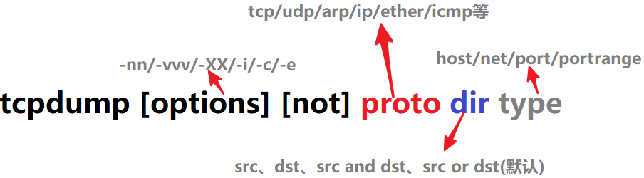
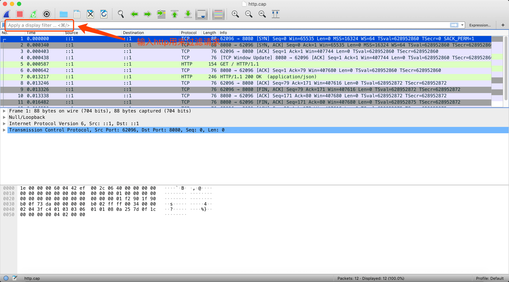
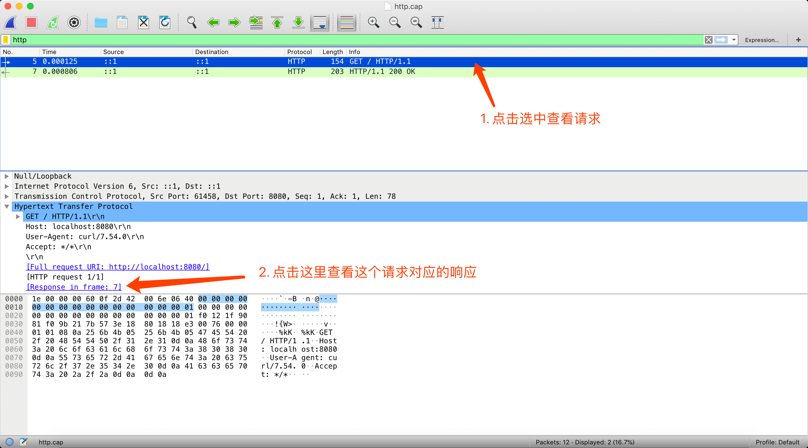
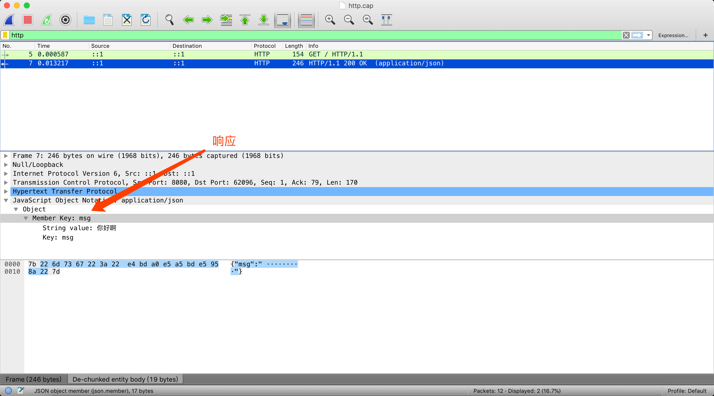

# 使用Wireshark和Tcpdump进行Http抓包

## Tcpdump
> [tcpdump](http://www.tcpdump.org/)是一款嗅探工具，它能探测到所有经过本地网卡的数据流，我们可以使用它在服务器完成抓包，保存抓包结果并且下载到本地交由Wireshark进行分析。

```bash
# tcpdump version 4.9.2
Usage: tcpdump [-aAbdDefhHIJKlLnNOpqStuUvxX#] [ -B size ] [ -c count ]
		[ -C file_size ] [ -E algo:secret ] [ -F file ] [ -G seconds ]
		[ -i interface ] [ -j tstamptype ] [ -M secret ] [ --number ]
		[ -Q in|out|inout ]
		[ -r file ] [ -s snaplen ] [ --time-stamp-precision precision ]
		[ --immediate-mode ] [ -T type ] [ --version ] [ -V file ]
		[ -w file ] [ -W filecount ] [ -y datalinktype ] [ -z postrotate-command ]
		[ -Z user ] [ expression ]

# 以下只描述日常使用的options
-i：指定需要监听的网卡，如果不特殊指定默认监听第一个（可以使用tcpdump -D命令查看可以监听的网卡）
-c: 收集指定的数量的数据包（是指满足条件的，比如说你指定收集10个包，但是有100个包，其中只有10个满足条件， 那么它就只会收集这十个）
-n: 以数字显示主机及端口
-Q: 指定要抓取的包是流入还是流出的包
-D: 查看可以监听的网卡
-w: 把数据包数据写入指定的文件。
```

## tcpdump表达式

```bash
tcpdump [options] [operator] [proto] [dir] [type]

以上是一个标准的表达式，多个不同的表达式组合可以通过操作符组合起来

operator: and / && / or / || / not / ! 

proto: tcp/udp/arp/ip/ether/icmp

dir: src/dst/src and dst/src or dst(默认)

type: host/net/port/portrange
```


## 常用tcpdump示例
```bash
tcpdump -i eth1 # 监视指定网络接口的数据包
tcpdump -i lo # 监视本机网络接口的数据包（比如说本地localhost:8001访问本地localhost:8002走的是Loopback回环网卡）
tcpdump tcp port 80 -w ./http.cap # 监视本机80端口的数据包，并且保存在当前目录的http.cap文件下
tcpdump tcp port 80 and (((ip[2:2] - ((ip[0]&0xf)<<2)) - ((tcp[12]&0xf0)>>2)) != 0) # 打印所有源或目的端口是80, 网络层协议为IPv4, 并且含有数据,而不是SYN,FIN以及ACK-only等不含数据的数据包.
tcpdump host hostname # 监视指定主机的数据包，例如所有进入或离开hostname的数据包
tcpdump src host hostname # 截获主机hostname发送的所有数据
tcpdump dst host hostname # tcpdump src host hostname
tcpdump tcp port 22 and host hostname # 监视指定主机和端口的数据包
```

## 抓取HTTP请求

1. 确认有[tcpdump](http://www.tcpdump.org/)命令和[Wireshark](https://www.wireshark.org/download.html)软件。

2. 创建`server.js`并且用`node server.js`启动http服务（在这里我们用nodejs模拟一个http服务器）
```javascript
// server.js
const http = require('http');

const server = http.createServer(function(req,res){
  res.setHeader('Content-Type', 'application/json');
  res.write(JSON.stringify({ msg: '你好啊' }));
  res.end();
});

server.listen(8080);

console.log('服务启动');
```

3. A终端输入`tcpdump -i lo tcp port 8080 -w ./http.cap`用来开始抓包并且保存在`http.cap`

4. B终端运行`curl http://localhost:8080`访问请求

5. A终端按`Ctrl + C`停止抓包。

6. 打开Wireshark，并且按`Command + O`快捷键导入`http.cap`文件。

7. 此时Wireshark界面如下图





