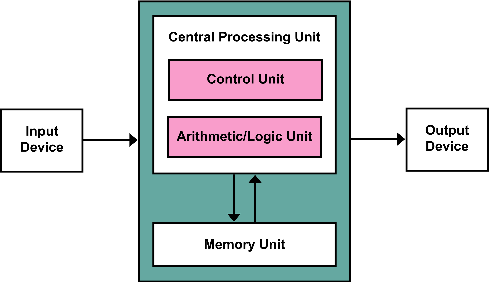
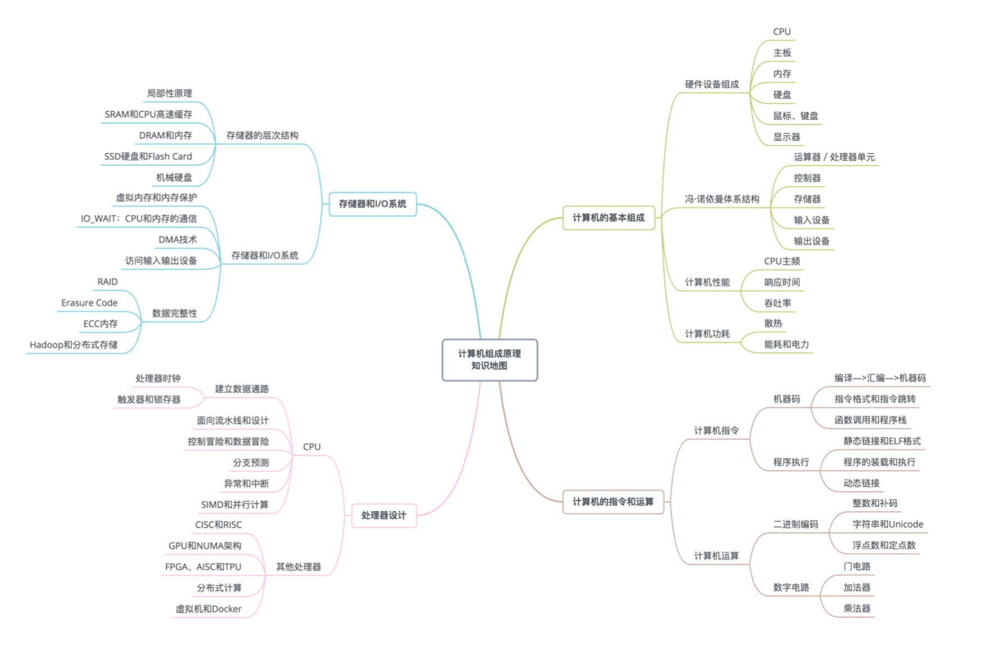

# 计算机结构组成

> 作为程序员，计算机是我们避免不了每天接触的，学好它能使我们的工作事半功倍，在这里我推荐非CS科班毕业的同学用[【计算机科学速成课】[40集全/精校] - Crash Course](https://www.bilibili.com/video/av21376839?from=search&seid=3571648163736648057)作为计算机科学的入门。
> 另外推荐英文不好的人看[CMU 15-213 CSAPP 深入理解计算机系统：Bilibili版](https://www.bilibili.com/video/av24540152/?p=25)，英文好的人看[CMU 15-213 CSAPP 深入理解计算机系统：Youtube版](https://www.youtube.com/playlist?list=PLmBgoRqEQCWy58EIwLSWwMPfkwLOLRM5R)来作为进阶补充

## 计算机组成
冯·诺依曼体系结构确立了我们现在每天使用的计算机硬件的基础架构，下面我们来看看基础架构的组成：

1. **处理器单元(Processing Unit)**：由算术逻辑单元(Arithmetic Logic Unit，ALU)和处理器寄存器(Processor Register)组成，用来完成各种算术和逻辑运算
2. **控制器单元 (Control Unit/CU)**：由指令寄存器(Instruction Reigster)和程序计数器(Program Counter)组成，用来控制程序的流程，也就是不同条件下的分支和跳转。处理器单元和控制器单元共同组成了CPU。
3. **内存（Memory Unit）**：用来存储数据(Data)和指令(Instruction)
4. **输入输出设备（Input Device/Output Device）**：输入设备比如键盘，输出设备比如打印机，显示器，像网卡既是输入也是输出设备
5. **外部存储**：还有一个没有显示在图上的外部存储，比如SSD硬盘，机械硬盘。

## 计算机组成脑图


## 计算机性能指标
对于计算机性能的计算有两个明显的指标可以进行评估：
1. **RT（响应时间，ResponseTime）**：执行一个程序或者一个请求从开始到结束到底花了多少时间，花的时间越少性能就越高，以搬家举例就是10分钟搬完一个家具和20分钟搬完一个家具的区别
2. **TPS（吞吐率，ThroughputPerSecond）**：吞吐率指的是我们在单位时间内数据搬运数量，一般以秒作为单位，可以理解为搬家，一次可以搬10件家具的搬家队和一次只能搬5件家具的效率自然不一样。需要注意，RT会影响吞吐率，RT越短吞吐率响应的越高

## 计算机的计时单位，CPU时钟频率
> 我们买电脑的时候有一个非常重要的属性就是主频，我的MAC处理器是**2 GHz Intel Core i5**。这个 2G hz就是我们电脑的CPU主频，即CPU内核工作的时钟频率。主频越高，CPU的运算速度就越快，**Ghz**是表示频率的单位，叫吉赫。1赫兹（Hz）表示事件每一秒发生一次。1吉赫（GHz）等于1000000000Hz。我们可以认为2 GHz 主频的意思就是处理器一秒钟可以运行2800000000条简单指令。

如果我们写了一段程序，运行了多次，可能每次程序的运行时间都是不一样的。这是因为一个CPU可能同时运行着多个程序，在多个程序之间来回切换，不一样的时间就说明CPU在执行这段程序的间隔里还去做了一些别的事。所以说要想准确的统计程序运行时间，就要把CPU去做别的事的时间刨除调，在 Linux 中有一个命令`time`可以帮助我们。
```shell
$ time seq 1000000 | wc -l
1000000

real	0m0.014s # 时钟时间，运行整个程序花费的完整时间，包括做别的事的时间，也叫做wall clock time
user	0m0.016s # 用户CPU时间：就是用户的进程获得了CPU资源以后，在用户态执行的时间。
sys	0m0.008s # 系统CPU时间：用户进程获得了CPU资源以后，在内核态的执行时间。
```
程序实际上花费的 CPU 时间就是 user + sys，在这里我们神奇的发现 CPU时间比Real时间要大

- Real < CPU，表明进程为计算密集型(CPU bound)，利用多核处理器的并行执行优势；
- Real ≈ CPU，表明进程为计算密集型(CPU bound)，未并行执行；
- Real > CPU，表明进程为I/O密集型(I/O bound)，多核并行执行优势并不明显。

这说明我们即使拿到了两个程序的 CPU 时间也不能说 A 程序就一定比 B 好，因为这个性能指标还会受到诸多因素影响，比如是否满载，是否降频，主板性能，内存性能都可能影响 CPU 时间。所以我们需要一个单位来评判，这个单位就是时钟周期，意思就是CPU切换的频率，在 CPU 的物理上有一个叫晶体振荡器(Oscillator Crystal)的东西，简称晶振，和电子表一样，晶振每次“滴答”就是一个时钟周期。由此我们得到一个公式：**程序的CPU执行时间=CPU时钟周期数×时钟周期时间**，再将CPU时钟周期数拆解一下，把它变成：**CPU时钟周期数=指令数×每条指令的平均时钟周期数(Cycles Per Instruction，简称CPI)**，最后公式就是**程序的CPU执行时间=指令数×每条指令的平均时钟周期数×时钟周期时间**。

可以得出结论，在同样的主频（时钟周期时间）下，指令书越少，每条指令平均时钟周期越少的程序性能越高。