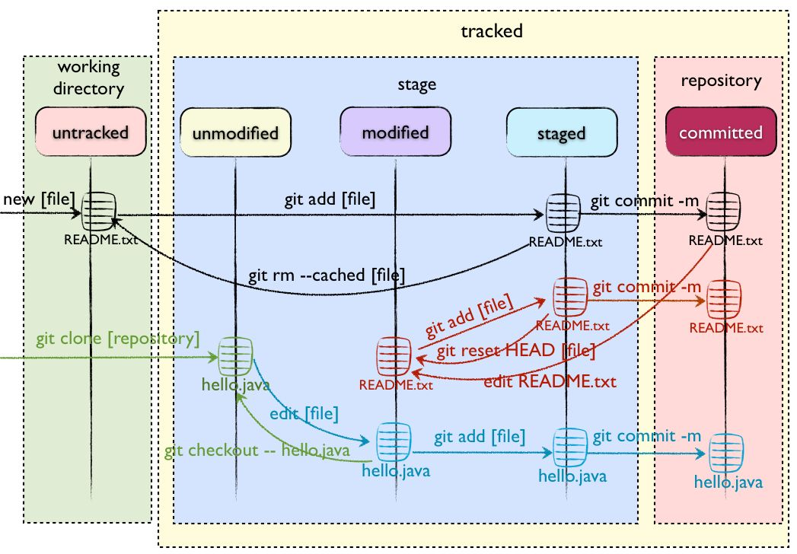
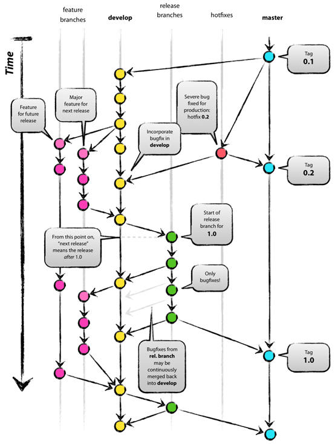

# Git

Git有三个区域，分别是工作区（Working Directory）、暂存区（Stage）、仓库区（Respository），具体关系如下图：



## 常用命令
### 配置
```bash
git config --local                              # 只对某个仓库有效
git config --global                             # 对当前用户所有仓库生效
git config --system                             # 对系统所有用户
git config --list                               # 配置列表
git config --global user.name [user.name]       # 设置用户名
git config --global user.email [user.email]     # 设置用户邮箱
```

### 修改和提交
```bash
git add .                                       # 跟踪所有改动过的文件
git add <file>                                  # 跟踪指定的文件
git mv <old> <new>                              # 文件改名或移动
git rm --cached <file>                          # 停止跟踪文件但不删除
git rm <file>                                   # 删除文件
git commit                                      # 提交所有更新过的文件
git commit -m "commit message"                  # 提交所有更新过的文件，指定消息
git commit --amend                              # 修改最后一次提交
git stash                                       # 将所有未commit的更改暂时保存起来
git stash list                                  # 所有已储存的内容
git stash drop                                  # 删除一个储存
git stash pop                                   # 将保存起来的更改应用到本地
```

### 分支与标签
```bash
git branch                                      # 显示本地所有分支
git branch -r                                   # 显示远程所有分支
git branch -a                                   # 显示本地以及远程所有分支
git checkout <branch/tag>                       # 切换到指定分支或标者签
git checkout -b <branch>                        # 基于当前分支创建新分支或者切换到新分支
git push remote <remote> <branch>               # 本地分支推送到远程
git branch --track <new-branch> <remote-branch> # 基于远程分支创建新的可追溯的分支
git branch -d <branch/>                         # 删除本地分支
git branch -D <branch/>                         # 强制删除本地分支
git push origin --delete <brnach>               # 删除远程分支
git tag                                         # 显示所有本地标签
git tag <tagname>                               # 基于当前最新提交创建标签
git tag -a <tagname>                            # 基于当前最新提交创建标签并且附加消息
git tag -d <tagname>                            # 删除本地标签
git push origin :refs/tags/<tag>                # 删除远程标签
git push --tags                                 # 上传所有标签
```

### 查看变更
```bash
git status                                      # 显示工作路径下已修改的文件
git diff                                        # 工作区和暂存区的差异
git diff --cached                               # 暂存区和本地库的差异
git diff <commit-id> <commit-id>                # 比较两个commit的差异
git diff branchA branchB -- <file>              # 查看不同分支提交的指定文件的差异
git log -p <file>                               # 显示某个文件的所有修改
git blame <file>                                # 谁，在什么时间，修改了文件的什么内容
git log                                         # 提交历史记录
git log --all --graph --pretty=format:'%Cred%h%Creset -%C(yellow)%d%Creset %s %Cgreen(%cr) %C(bold blue)<%an>%Creset' --abbrev-commit --date=relative # 非常好用的git log命令美化版
```

### 撤销
```bash
git reset --hard HEAD                            # 撤销工作区中所有未提交的修改
git checkout <file>                              # 让指定文件从暂存区回退到工作区
git revert <commit>                              # 撤销指定commit提交
git reset --mixed <commit>                       # 回退到某个版本，只保留源码，这是默认选项
git reset --soft <commit>                        # 只回退commit的信息，如果仍然要提交，直接commit即可
git reset --hard <commit>                        # 彻底回退到某个版本，不保留源码
```

## 特殊操作
```bash
git cherry-pick <commit>                          # pick指定commit合并到当前分支
git merge <branach>                               # 将目标分支合并到当前分支，如果有冲突，则会在解决完冲突后自动产生一个commit
git merge --no-ff                                 # 强行分叉，无论有没有冲突都会产生一个commit，推荐使用
git merge --squash                                # 将被合并分支的commit合并
git rebase -i <branch>                            # 衍合，会找到两个分支的公共点，然后依次进行合并，不会有merge产生的合并记录
git rebase -i <start-commit> <end-commit>         # 合并commit,不写start-commit就默认为当前commit
                                                  # pick，保留commit
                                                  # reword，保留commit，但修改commit的commit message
                                                  # eidt，保留commit，但修改该提交内容和commit，message
                                                  # squash，将该commit和前一个commit合并
                                                  # fixup，将该commit和前一个commit合并，但不保留commit         message
                                                  # exec，执行shell命令
                                                  # drop，丢弃该commit
```


### 远端操作
```bash
git remote -v                                   # 查看远程版本库信息
git fetch <remote>                              # 从远程库获取代码，如果远程代码比本地新，会有合并记录
git pull                                        # 从远程分支获取代码并且进行merge操作
git pull --rebase                               # 从远程分支获取代码并且进行rebase
git remote remove <remote>                      # 删除远程库和本地库的连接关系
git remote add <remote> <url>                   # 增加远程库和本地库的链接关系
```

## GitFlow工作流程

该工作流程由` Vincent Driessen`在他的文章[a-successful-git-branching-model](https://nvie.com/posts/a-successful-git-branching-model/)中提出。



### GitFlow使用原则
- Master分支是线上稳定分支，Release通常用作测试分支，Develop分支是开发应用的主分支
- 所有的功能开发都在Feature分支进行，然后合并到Develop分支
- Release分支发布后出现问题，直接在Release分支修改，避免Develop分支代码污染

### GitFlow分支
1. Master分支：这个分支是发布到生产环境的代码，这个分支只能从其他分支合并，不能在这个分支直接修改
2. Develop分支：这个分支是主开发分支，包含所有要发布到下一个Release的代码，这个主要合并自其他分支，比如Feature分支
3. Feature分支：Feature 分支主要用来开发一个新的功能，一旦开发完成，合并回Develop分支，并且进入下一个Release。Feature分支可以选择删除或者保留
4. Release分支：当需要发布一个新Release的时候，基于Develop分支创建一个Release分支，Release分支在测试过程中可能会修改，完成Release后，合并到Master和Develop分支，完成后可以删除该分支
5. Hotfix分支：当在Master分支发现新的Bug时候，需要创建一个Hotfix分支, 完成Hotfix后，合并回Master和Develop分支，所以Hotfix的改动会进入下一个Release。完成后可以删除该分支

### GitFlow快捷操作
建议使用[gitflow](https://github.com/nvie/gitflow)脚本快捷的进行该工作流程，安装方法和使用方法见[gitflow](https://github.com/nvie/gitflow)文档。

## CommitMessage规范
基于[AngularJS Git Commit Message Conventions](https://docs.google.com/document/d/1QrDFcIiPjSLDn3EL15IJygNPiHORgU1_OOAqWjiDU5Y/edit)规范，可以根据不同项目自行定制。

### CommitMessage格式
```
格式要求
<type>(<scope>): <subject>
<BLANK LINE>
<body>
<BLANK LINE>
<footer>

格式说明
# 标题行：50个字符以内，描述主要变更内容
#
# 主体内容：更详细的说明文本，建议72个字符以内。 需要描述的信息包括:
#
# * 为什么这个变更是必须的? 它可能是用来修复一个bug，增加一个feature，提升性能、可靠性、稳定性等等
# * 他如何解决这个问题? 具体描述解决问题的步骤
# * 是否存在副作用、风险? 
#
# 尾部：如果需要的话可以添加一个链接到issue地址或者其它文档，或者关闭某个issue。
```

### 所有的`type`类型如下：
- feat： 新增 feature
- fix: 修复 bug
- docs: 仅仅修改了文档，比如 README, CHANGELOG, CONTRIBUTE等等
- style: 仅仅修改了空格、格式缩进、逗号等等，不改变代码逻辑
- refactor: 代码重构，没有加新功能或者修复 bug
- perf: 优化相关，比如提升性能、体验
- test: 测试用例，包括单元测试、集成测试等
- chore: 改变构建流程、或者增加依赖库、工具等
- revert: 回滚到上一个版本
